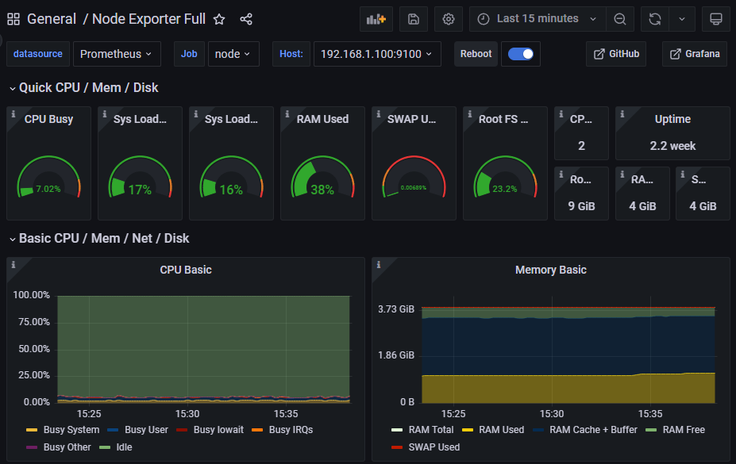
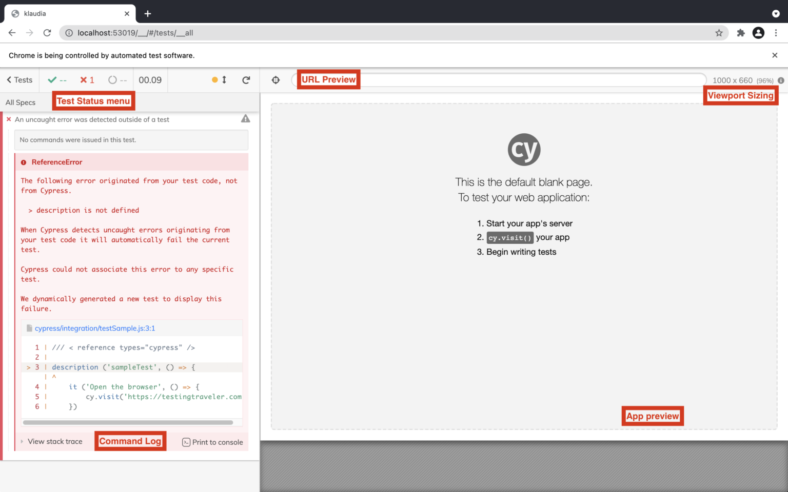
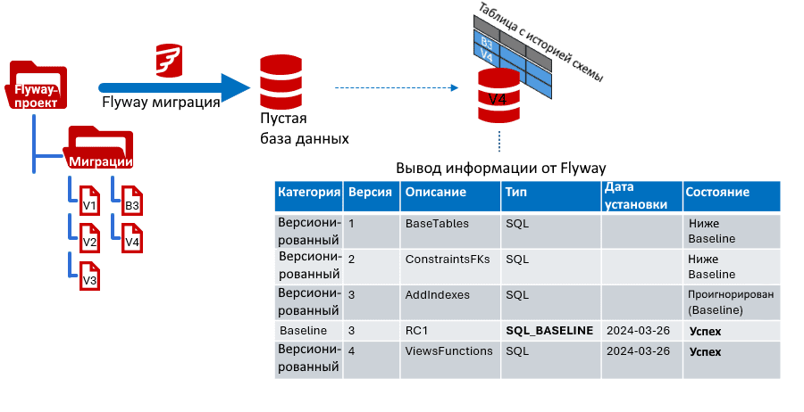
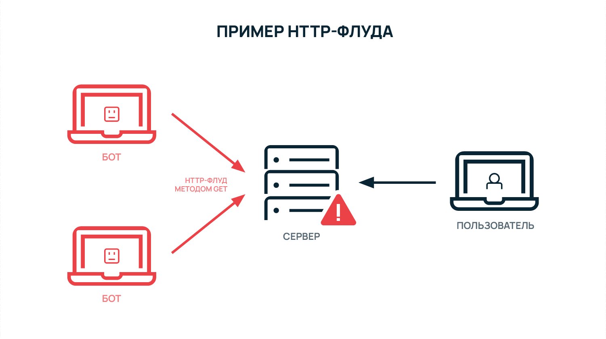
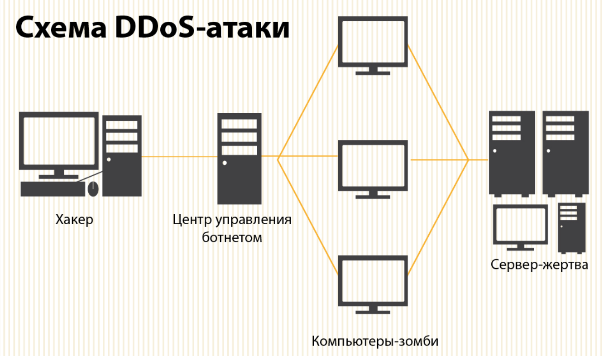

# Практическая работа

## Тема: Применение методов обеспечения качества функционирования компьютерных систем

## Цель: Ознакомиться с практическими аспектами стандартизации, тестирования и защиты информации.

---

## Задание 1. Анализ требований к качеству ПО

### Общее описание
Это задание направлено на изучение и применение стандартов качества программного обеспечения. В современной разработке качество ПО является критическим фактором успеха проекта. Мы работаем с CRM-системой, где важны как производительность, так и надежность.

### Условие
Компания разрабатывает CRM-систему для розничной сети. Требования:
- Обработка 10 000 запросов в час.
- Время восстановления после сбоя — не более 15 минут.
- Совместимость с ОС Windows 10/11 и Linux.

### Действия и пошаговые инструкции

#### Составление матрицы качества по ISO 9126
   Характеристика          | Метрики                                                                 |
 |-------------------------|------------------------------------------------------------------------|
 | Функциональность        | Количество реализованных функций: 100%                                  |
 | Надежность              | Время безотказной работы: >99.9%                                        |
 |                         | Среднее время восстановления: <15 минут                                  |
 |                         | Максимальное количество ошибок: <0.1% запросов                          |
 | Удобство использования | Время обучения пользователей: <2 часа                                    |
 | Эффективность           | Время отклика системы: <500 мс                                          |
 | Сопровождаемость        | Время исправления ошибок: <4 часа                                       |
 | Переносимость           | Совместимость с ОС: Windows 10/11, Linux                                 |

#### Настройка мониторинга производительности

##### Установка Prometheus

# Пример конфигурации Prometheus
global:
  scrape_interval: 15s

scrape_configs:
  - job_name: 'prometheus'
    static_configs:
      - targets: ['localhost:9090']

### Настройка Grafana

    Дашборды для:
        Времени отклика системы
        Количества запросов в секунду
        Использования ресурсов
        Количества ошибок

Проведение нагрузочного тестирования
### Подготовка тестов в JMeter

<!-- Пример конфигурации JMeter -->
<TestPlan>
  <ThreadGroup>
    <num_threads>1000</num_threads>
    <ramp_time>300</ramp_time>
    <duration>1800</duration>
  </ThreadGroup>
</TestPlan>

**Анализ результатов**

    Время отклика (целевое: <500мс)
    Пропускная способность (цель: 10000 запросов/час)
    Процент ошибок (допустимо: <1%)

# Задание 2. Разработка плана тестирования
### Общее описание

Тестирование является ключевым этапом в разработке надежного программного обеспечения. В данном задании мы работаем с веб-приложением для онлайн-обучения, где критически важны безопасность и производительность.
Условие

Требуется проверить веб-приложение для онлайн-обучения. Риски:

    Утечка данных пользователей.
    Сбои при одновременной работе 500+ пользователей.

Действия и пошаговые инструкции
Подготовка автоматизированных тестов
Настройка Selenium WebDriver

from selenium import webdriver

def test_login_security():
    driver = webdriver.Chrome()
    driver.get("https://your-app.com")

    # Проверка на SQL-инъекции
    unsafe_inputs = ["' OR '1'='1", "admin'--", "1' DROP TABLE users--"]
    for input in unsafe_inputs:
        assert not is_vulnerable(input)

Настройка Cypress для E2E тестирования

describe('User Authentication', () => {
  it('should safely handle invalid inputs', () => {
    cy.visit('/login')
    cy.get('#username').type('test@example.com')
    cy.get('#password').type('SecurePassword123')
    cy.get('form').submit()
    cy.url().should('include', '/dashboard')
  })
})

Настройка тестирования безопасности
Конфигурация OWASP ZAP

    Настройка активного сканирования
    Определение правил безопасности
    Настройка отчетов

Внедрение проверок безопасности

    Чек-лист безопасности:
        Проверка защиты от XSS
        Тестирование CSRF-токенов
        Проверка настроек CORS
        Тест на SQL-инъекции
        Проверка защиты от брутфорса

# Задание 3. Конфигурационное управление
### Общее описание

Управление конфигурациями - это фундаментальный аспект современной разработки ПО. В этом задании мы организуем процесс управления версиями программного обеспечения и его компонентов.
Условие

В компании используются разные версии ПО для обработки данных.
Действия и пошаговые инструкции
Настройка CI/CD пайплайна
Создание GitHub Actions workflow

name: CI/CD Pipeline
on:
  push:
    branches: [ main ]

jobs:
  test:
    runs-on: ubuntu-latest
    steps:
      - uses: actions/checkout@v2
      - name: Run Tests
        run: |
          npm install
          npm test
      - name: Security Scan
        run: |
          npm audit
          trivy scan .

Настройка автоматического деплоя

    Настройка окружений (dev, staging, prod)
    Конфигурация автоматического развертывания
    Настройка откатов (rollback)

### Внедрение системы управления версиями БД

Пример миграции Flyway

CREATE TABLE users (

    id SERIAL PRIMARY KEY,
    username VARCHAR(50) NOT NULL,
    email VARCHAR(100) NOT NULL,
    created_at TIMESTAMP DEFAULT CURRENT_TIMESTAMP
);

# Задание 4. Защита информации
Общее описание

В эпоху цифровизации защита персональных данных становится критически важной задачей. Это задание познакомит вас с практическими аспектами обеспечения безопасности данных в информационных системах.
Условие

Разработайте меры для защиты базы данных с персональными данными.
Действия и пошаговые инструкции
Внедрение шифрования данных
Настройка шифрования в покое

from cryptography.fernet import Fernet

def encrypt_sensitive_data(data):
    key = Fernet.generate_key()
    f = Fernet(key)
    encrypted_data = f.encrypt(data.encode())
    return encrypted_data

Настройка шифрования в движении

    Настройка SSL/TLS
    Внедрение HTTPS
    Настройка perfect forward secrecy

Внедрение двухфакторной аутентификации

import pyotp

def setup_2fa():
    # Генерация секретного ключа
    secret = pyotp.random_base32()
    # Создание временного OTP
    totp = pyotp.TOTP(secret)
    # Получение текущего кода
    current_otp = totp.now()

# Задание 5. Анализ рисков
Общее описание

Умение предвидеть и минимизировать риски - ключевой навык в современной разработке ПО. В этом задании мы работаем с реальным сценарием противодействия DDoS-атакам в системе электронной коммерции.
Условие

Система электронной коммерции столкнулась с риском DDoS-атак.
Действия и пошаговые инструкции
Создание системы мониторинга рисков
Настройка системы оповещений

alerts:
  - name: high_error_rate
    condition: error_rate > 5%
    severity: critical
    notification:
      - slack
      - email

Создание плана реагирования

    План действий при DDoS:
        Активация WAF
        Включение режима защиты CDN
        Анализ трафика
        Блокировка вредоносных IP
        Масштабирование ресурсов

Внедрение метрик безопасности

    Настройка сбора метрик MTTR/MTBF
    Создание дашбордов безопасности
    Настройка автоматических отчетов

