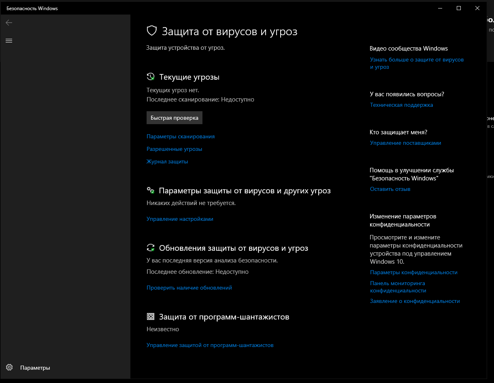
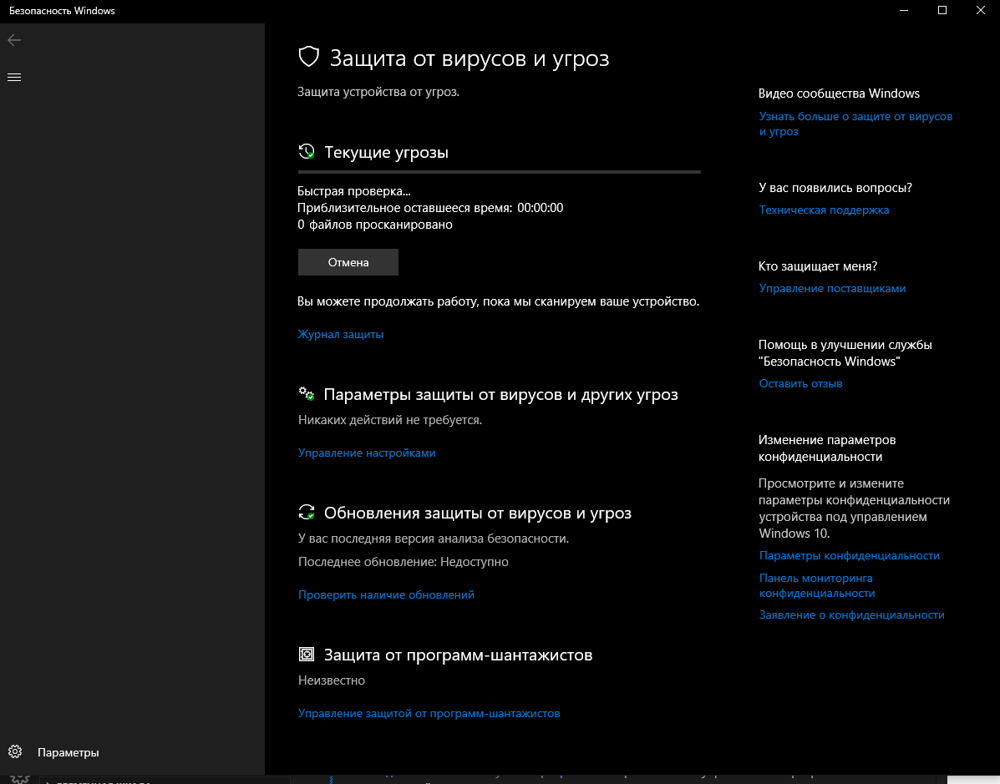
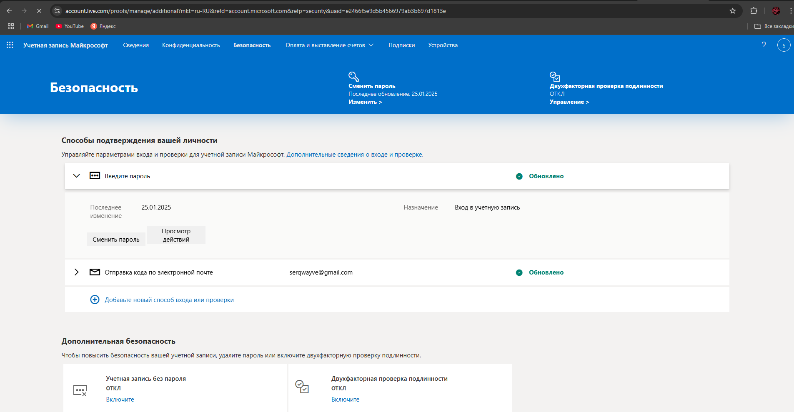

# 🛡️ Учебная практика: Установка антивирусного ПО и настройка безопасности  
**Выбранный антивирус:** Windows Defender  

---

## 1. Обоснование выбора антивирусного ПО  

| Антивирус       | Плюсы | Минусы | Бесплатная версия | Потребление ресурсов |
|-----------------|-------|--------|--------------------|-----------------------|
| Windows Defender | - Встроен в Windows 10/11 - Не требует установки - Минимальное влияние на производительность - Интеграция с системой | - Менее гибкие настройки по сравнению с платными аналогами - Ограниченные дополнительные функции (например, VPN) | Да | Низкое |

**Почему выбран именно он:**  
Windows Defender был выбран из-за его полной интеграции с ОС, отсутствия необходимости в дополнительной установке и низкого потребления ресурсов. Это оптимальное решение для слабых ПК и пользователей, которым не требуются расширенные функции платных антивирусов.

---

## 2. Установка антивируса  
- **Где скачали:** Не требуется — встроен в Windows.  
- **Дополнительные предложения:** Отсутствуют.  
- **Выбранные опции:** Активирована защита в реальном времени и облачная проверка.  

**Скриншоты:**  

---

## 3. Первичная настройка безопасности  
Настроено:  
- ✅ **Обновление баз данных:** Автоматическое через Центр обновления Windows.  
- ✅ **Активная защита:** Включена в разделе "Защита от вирусов и угроз".  
- ✅ **Автоматическое сканирование:** Еженедельное (по умолчанию).  
- ✅ **Полная проверка системы:** Выполнена вручную через "Проверить сейчас".  
- ✅ **Дополнительные функции:**  
  - [x] Фаерволл (через "Брандмауэр Защитника Windows")  
  - [x] Защита USB-устройств (включена "Контролируемый доступ к папкам")  
  - [ ] Родительский контроль (требуется настройка через Microsoft Family)  
  - [x] Веб-защита (SmartScreen для браузеров Edge и Chrome).  

**Скриншоты настроек:**  

---

## 4. Дополнительные меры безопасности  
Выполнено:  
1. **Обновление системы Windows:** Проверка обновлений через "Параметры → Обновление и безопасность".  
2. **Отключение автозапуска с флешек:** Через "Редактор групповой политики" (`gpedit.msc`).  
3. **Удаление неиспользуемых программ:** Через "Панель управления → Программы и компоненты".  

---

## 5. Настройка двухфакторной аутентификации  
- Включена 2FA для учетной записи Microsoft через [account.microsoft.com](https://account.microsoft.com).  
- Использовано приложение Authenticator для генерации кодов.  

---

## Итоги  
- **Что нового узнали:** Windows Defender обладает достаточным функционалом для базовой защиты без установки стороннего ПО.  
- **Трудности:** Неочевидные настройки контролируемого доступа к папкам.  
- **Выводы:** Встроенные инструменты Windows могут быть эффективны при правильной настройке, но для расширенной защиты стоит рассмотреть дополнительные меры (например, резервное копирование).  

